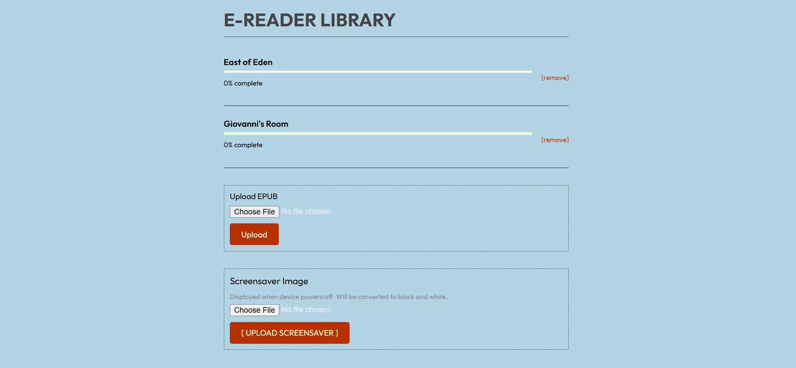
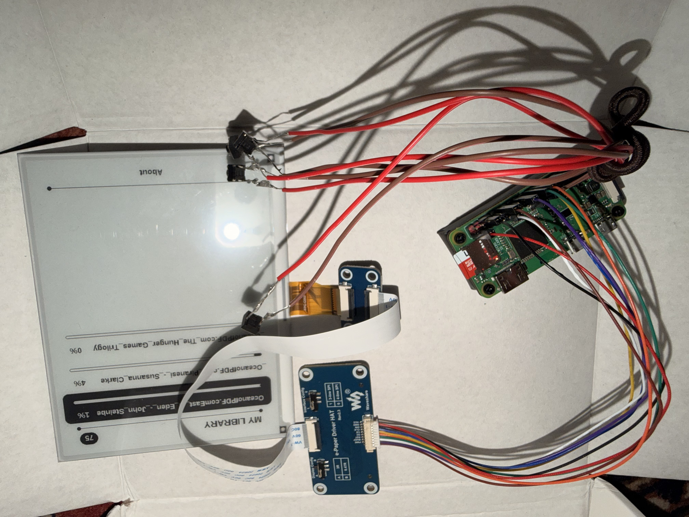
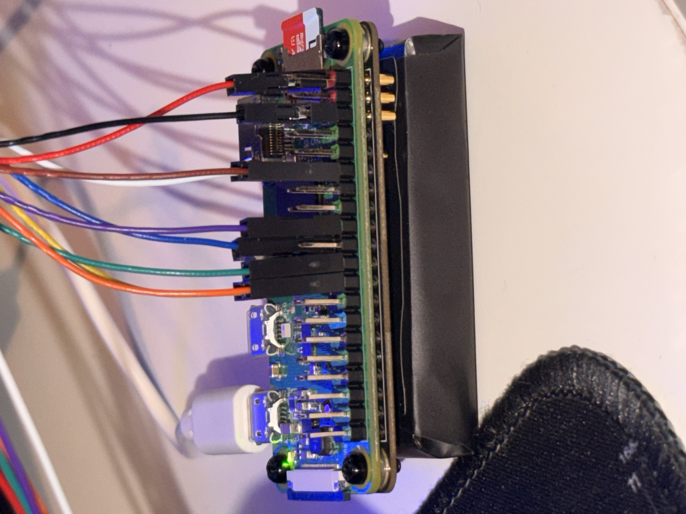

# E-Reader

A custom e-reader built with a Raspberry Pi Zero 2W and Waveshare 5.83" e-ink display. The goal was to design something from scratch that worked similarly to a commercial ereader with the advantage of full control and flexibility. I wanted a device where i could upload epub files and a screensaver image remotely onto a server via WiFi connection.

---

## Parts

 - Raspberry Pi Zero 2W 
 - Waveshare 5.83" e-ink HAT V2  
 - PiSugar 3 (1200mAh) 
 - MicroSD card 32GB 
 - 4× tactile buttons
 - Dupont jumper wires  

---

## Raspberry Pi Setup

The Pi runs Raspberry Pi OS Lite (32-bit) which was flashed to the SD card using Raspberry Pi Imager.

After SSHing in once the Pi is booted, update the system and install the required packages:

```bash
sudo apt update && sudo apt upgrade -y
sudo apt install python3-pip python3-dev git fonts-liberation -y
pip3 install -r requirements.txt --break-system-packages
```

---

## Enabling SPI and I2C

Two hardware interfaces need enabling via `raspi-config`:

**SPI** is the communication protocol the e-ink display uses to receive bitmap images from the Pi. Four GPIO pins carry the data — clock, data, chip select, and data/command. Without SPI enabled the display can't receive anything.

**I2C** is used by the PiSugar battery board to report battery percentage and charging status back to the Pi. It's a two-wire protocol designed for short board-to-board communication.

---

## Software

The project is split into four Python files:

**`progress.py`** — SQLite database that saves reading position (current page and total pages) for each book. Every page turn writes to it and its read on startup to resume where you left off.

**`server.py`** — Flask web server that runs in the background. Visiting the Pi's IP address on port 5000 from any device on the same WiFi shows a library page where you can upload EPUBs, delete books, and upload a custom screensaver image. The index.html template draws the webpage for the server.



**`renderer.py`** — takes book text and draws it as a bitmap image at the display's resolution (480×648 portrait). Handles EPUB parsing, text extraction, pagination by character count, and rendering the home screen, about screen, and shutdown screen. Tested on a laptop by saving PNG previews before deploying to the Pi.

**`reader.py`** — main program that initialises the display, starts the server in the background, listens for button presses via GPIO interrupts, and manages the state machine (home, reading, about). Calls renderer.py to draw screens and progress.py to save position.

---

## Prototype Assembly

The hardware parts were chosen for their easy assembly.

The pisugar battery connects firectly to the back of the Pi, and the dupont jumper wires connect easily to the pi's GPIO pins, connecting the pi to the e-ink display and control buttons. This allows for easy initial prototyping as no soldering is required.







## Button Wiring

Four buttons are used: Up, Down, Select, and Menu. Each button connects between a GPIO pin and a Ground pin on the Pi's 40-pin header.

In the Assembled prototype, each component is using a separate ground pin for its ground connection. Of course, a poished version would common all button grounds to a single GPIO ground pin, reducing wiring complexity and freeing up ground pins for other components.

Since the e-ink display connects via the 9-pin cable rather than sitting directly on the GPIO header, all 40 pins are accessible for buttons.

| Button | GPIO | Board Pin | Ground Pin |
|---|---|---|---|
| Up | GPIO 5 | Pin 29 | Pin 30 |
| Down | GPIO 6 | Pin 31 | Pin 34 |
| Select | GPIO 13 | Pin 33 | Pin 39 |
| Menu | GPIO 19 | Pin 35 | Pin 25 |

The Menu button handles both short press (return to home) and long press (2 seconds — shutdown). On shutdown, the display shows either a custom uploaded screensaver or a generated powered-off screen, then the Pi shuts down cleanly.

---

## Autostart on Boot

A systemd service starts reader.py automatically when the Pi boots.

```bash
sudo nano /etc/systemd/system/ereader.service
```

```
[Unit]
Description=E-Reader
After=multi-user.target

[Service]
ExecStart=/usr/bin/python3 /home/pi/e-reader/reader.py
WorkingDirectory=/home/pi/e-reader
Restart=on-failure
User=pi

[Install]
WantedBy=multi-user.target
```

```bash
sudo systemctl enable ereader.service
sudo systemctl start ereader.service
```

